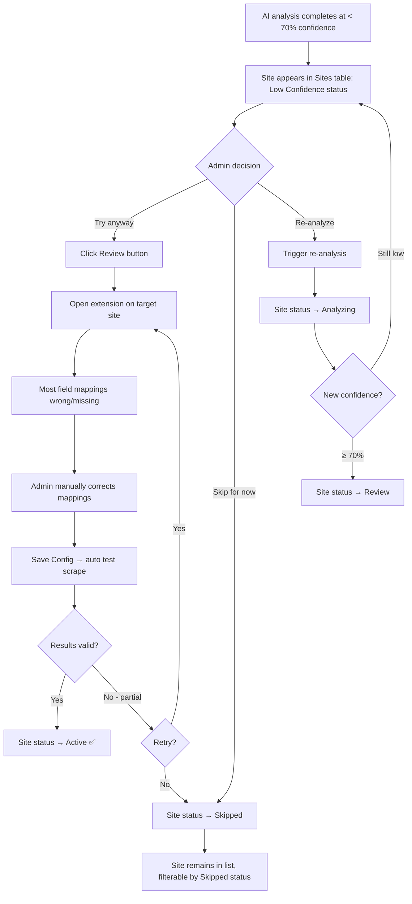
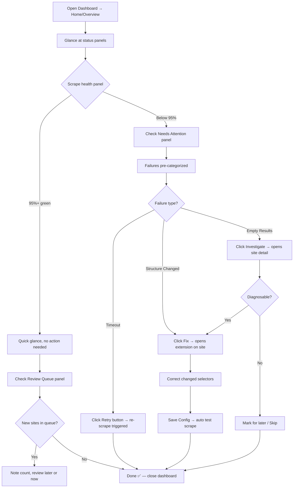
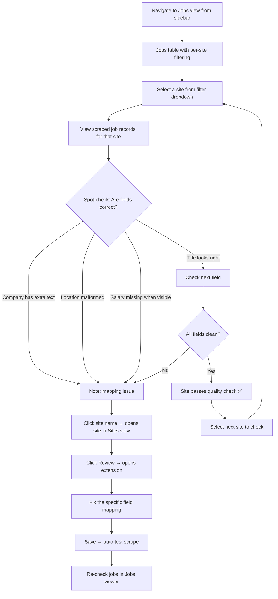

# UX Design Specification scrapnew

**Author:** Oren
**Date:** 2026-03-10

---

<!-- UX design content will be appended sequentially through collaborative workflow steps -->

## Executive Summary

### Project Vision

scrapnew is a job scraping infrastructure platform that aggregates and stores job listings from 5000+ Israeli job sites. It employs an AI-first site learning pipeline where automated analysis handles site structure detection, with a targeted human correction loop via a Chrome extension that teaches the system where AI confidence falls short. The platform is informed by a failed prior attempt where full automation proved unreliable — the key architectural insight being that a human teaching mechanism at the right moment is the unlock for scaling.

The system comprises three distinct surfaces — Admin Dashboard (SPA), Backend API/Scraping Engine, and Chrome Extension — operated by a single admin who manages the entire scraping pipeline.

### Target Users

**Solo Admin Operator (Oren)** — Technically capable, built the system, understands the architecture deeply. The primary goal is minimizing daily operational time while scaling from 0 to 5000+ sites. The workflow centers on: submit URL → AI analyzes → review/correct via Chrome extension → save config → scrape runs. Daily operations should trend toward glanceable dashboard checks under 10 minutes.

No secondary users — single operator system at this stage.

### Key Design Challenges

1. **Three-surface coherence** — Dashboard, Chrome Extension, and the flow between them must feel like one unified tool despite being technically separate surfaces. The handoff from "review queue in dashboard" to "correction in Chrome extension" is a critical transition point that must be seamless.
2. **Information density vs. glanceability** — The dashboard must surface 500+ sites with statuses, failures, confidence scores, and alerts without overwhelming the operator. The morning operational check should take under 10 minutes.
3. **Chrome extension interaction model** — Three distinct modes (Review, Navigate, Form Record) in an extension overlay on unpredictable third-party sites. The overlay must be clear and usable regardless of the target site's design, layout, or color scheme.
4. **Status lifecycle clarity** — Sites move through analyzing → review → active → failed → skipped. The admin must instantly understand where every site is and what action (if any) is needed.

### Design Opportunities

1. **Efficiency-first dashboard** — Single user means the entire UX can be optimized for one specific workflow rather than generalized for unknown users. No onboarding flows, no role-based views — pure operational efficiency.
2. **Confidence as a UX driver** — AI confidence scores can visually drive the entire interface: color-coding, sort order, attention prioritization. High confidence = green/auto, low confidence = amber/needs attention.
3. **Progressive automation visibility** — The learning flywheel can be made visible in the UX: accuracy trends, correction rate decreasing over time, system improvement metrics. This reinforces the platform's value proposition directly in the interface.

## Core User Experience

### Defining Experience

The core experience of scrapnew is the **review-and-correct loop** — the Chrome extension interaction where the admin verifies and fixes AI-generated field mappings on a live target site. This is the interaction that determines whether 5000+ sites is feasible for a single operator. If correction takes 2-3 minutes, the system scales. If it takes 10+ minutes, it doesn't.

The secondary core experience is the **morning operations check** — a glanceable dashboard that surfaces only what needs attention, enabling the admin to triage overnight results in under 10 minutes.

Everything else — URL submission, AI analysis, test scraping, data storage — is infrastructure that supports these two core loops.

### Platform Strategy

| Surface | Platform | Input Method | Primary Use |
|---------|----------|-------------|-------------|
| Admin Dashboard | Web SPA (desktop-optimized) | Mouse/keyboard | Site management, monitoring, data review |
| Chrome Extension | Chrome browser extension | Mouse/keyboard with page interaction | Field mapping review and correction |
| Backend API | Server-side | N/A (consumed by other surfaces) | AI analysis, scraping, data storage |

- **Desktop-only** — this is an admin operations tool, not a consumer product. No mobile or responsive design needed.
- **Chrome-primary** — the extension dependency means Chrome is the required browser. Dashboard should work in Chrome.
- **No offline requirement** — all operations require the backend API.
- **Real-time updates** — dashboard needs live status for active analyses and scrapes (SSE or WebSocket).

### Effortless Interactions

**Zero-thought actions:**
- **URL submission** — paste a URL, hit submit, walk away. No configuration, no options, no analysis method selection. The system figures it out.
- **Config save → test scrape** — saving a corrected config should automatically trigger a validation scrape. No separate "run test" step.
- **Dashboard triage** — failures should be pre-categorized (timeout, structure change, empty results) so the admin knows the action without investigation.

**Automated by design:**
- AI analysis runs immediately after URL submission — no manual trigger
- Sites above 70% confidence auto-route to review queue — no manual sorting
- Status lifecycle transitions happen automatically based on system events
- Alerts surface only when admin action is required — no informational noise

### Critical Success Moments

1. **"The AI nailed it"** — Admin opens the Chrome extension on a new site and sees the field mapping is 90%+ correct. Two small fixes, save, done in 60 seconds. This is the moment that validates the entire platform.

2. **"Clean overnight run"** — Morning dashboard shows 500/500 sites scraped successfully. No alerts, no failures. The system just works. Coffee takes longer than the daily check.

3. **"It's getting smarter"** — After configuring 200 sites, the admin notices AI confidence on new sites has climbed from 70% to 85%. Fewer corrections needed per site. The flywheel is real.

4. **"Make-or-break flow"** — The end-to-end loop: URL → AI analysis → extension correction → config saved → test scrape → valid jobs visible in dashboard. If this flow breaks at any point, the product fails.

### Experience Principles

1. **Correction, not configuration** — The admin should never build a mapping from scratch. The AI provides the starting point; the human only fixes what's wrong. Every interaction should feel like editing, not creating.

2. **Glanceable operations** — Dashboard views should answer "what needs my attention?" in under 5 seconds. Status, color-coding, and counts over detailed tables. Drill-down available but never required for triage.

3. **Submit and forget** — Any action that triggers background processing (URL submission, re-analysis, test scrape) should require zero follow-up. The system notifies when results are ready or when something fails.

4. **Confidence drives everything** — AI confidence scores are not just metadata — they determine queue priority, visual treatment, and attention allocation. High confidence = less admin time. The UX should make this relationship visible and intuitive.

## Desired Emotional Response

### Primary Emotional Goals

**In Control & Confident** — The admin should feel like the master operator of a well-oiled machine. Every interaction reinforces that the system is working, the data is flowing, and the platform is scaling. The dominant emotional state is quiet confidence — "I've got this."

**Efficient & Productive** — Every minute spent in the tool should feel productive. No friction, no busywork, no unnecessary steps. The feeling of processing 10 sites in 30 minutes should feel like a satisfying assembly line, not a tedious chore.

**Trust in the AI** — The admin should progressively trust the AI's analysis more. Early skepticism ("let me check everything") should naturally evolve into calibrated trust ("the AI's been right 85% of the time, I'll focus on the flagged fields").

### Emotional Journey Mapping

| Stage | Desired Emotion | Design Implication |
|-------|----------------|-------------------|
| **URL submission** | Effortless, no anxiety | One input, one button, instant feedback |
| **Waiting for AI analysis** | Unconcerned, productive | Non-blocking — admin does other things, gets notified |
| **Opening extension for review** | Curious, prepared | Clear overlay shows exactly what AI found, confidence visible |
| **Correcting mappings** | Focused, fast | Direct manipulation — click element, assign field, move on |
| **Saving config** | Accomplished, brief satisfaction | Instant save confirmation, auto-triggered test scrape |
| **Viewing test scrape results** | Validated, confident | Clean job records confirm the config works |
| **Morning dashboard check** | Calm, in control | Green = good, amber = attention, red = action. Glanceable. |
| **Handling failures** | Pragmatic, not stressed | Pre-categorized failures with clear next actions |

### Micro-Emotions

**Prioritized emotional states:**

- **Confidence over confusion** — The admin should always know what to do next. No dead ends, no ambiguous states. Every screen answers "what's the next action?"
- **Trust over skepticism** — AI results should be presented transparently (confidence scores, field-level detail) so trust is earned, not demanded.
- **Accomplishment over frustration** — Even difficult sites (low confidence) should feel manageable. "Skip and move on" is a valid success — not every site needs to work.
- **Satisfaction over delight** — This is an ops tool. Delight comes from efficiency, not animations. The pleasure is in watching 500 sites scrape overnight, not in a confetti animation.

**Emotions to actively avoid:**
- **Overwhelm** — from too many sites, too much data, too many alerts
- **Distrust** — from AI making silent errors or unexplained decisions
- **Tedium** — from repetitive correction workflows that feel manual rather than assisted
- **Anxiety** — from not knowing if the system is working when you're not looking

### Design Implications

| Emotional Goal | UX Design Approach |
|---------------|-------------------|
| In control | Status overview always visible; site counts, success rates, and queue depth shown at a glance |
| Efficient | Keyboard shortcuts for common extension actions; batch operations where possible; minimal clicks per task |
| Trust in AI | Show confidence scores per-field, not just per-site; highlight which fields the AI is uncertain about so corrections are targeted |
| Calm operations | Dashboard defaults to "needs attention" view — not "everything happening." Quiet when things are good. |
| Pragmatic failure handling | Failure alerts include recommended action (re-scrape, re-analyze, skip) — admin doesn't have to diagnose |

### Emotional Design Principles

1. **Quiet when good, loud when needed** — The system should be nearly invisible during successful operations. Alerts, notifications, and visual emphasis only appear when the admin needs to act. No celebration of normal operation.

2. **Transparency builds trust** — Never hide AI uncertainty. Show confidence scores, highlight uncertain fields, explain why analysis produced certain results. The admin trusts the system more when they can see its reasoning.

3. **Progress is the reward** — The emotional payoff is watching the numbers grow: sites configured, scrapes succeeding, AI accuracy climbing. Make these metrics visible and trending. The flywheel effect should feel tangible.

4. **Graceful degradation of attention** — As the system scales from 10 to 5000 sites, the emotional experience should stay the same: calm, controlled, efficient. The UX must scale with the data without increasing cognitive load.

## UX Pattern Analysis & Inspiration

### Inspiring Products Analysis

**1. Grafana — Operations Dashboard**

Grafana is the gold standard for glanceable operational dashboards. What it does well:
- **Status-at-a-glance panels** — color-coded health indicators (green/amber/red) that communicate state without reading
- **Drill-down hierarchy** — overview → panel → detail. You never see more than you need at any level
- **Alert-driven operations** — quiet when healthy, loud when broken. The admin only engages when something needs attention
- **Dense but not cluttered** — packs enormous amounts of data into a single view through effective use of sparklines, gauges, and compact tables

**Relevance to scrapnew:** The dashboard should follow Grafana's philosophy — status panels for scrape health, site counts by status, confidence distribution. Drill-down from overview to individual site to specific scrape run.

**2. Retool / Appsmith — Admin Tool Builders**

Internal tool builders nail the "functional over beautiful" admin interface:
- **Table-centric views** — data tables with inline actions, filters, and sorting as the primary interaction pattern
- **Action buttons in context** — "Re-scrape," "Skip," "Re-analyze" appear right next to the data they affect, not in menus
- **Minimal navigation** — sidebar with 4-5 sections max. Everything reachable in one click
- **Form simplicity** — inputs are direct, no multi-step wizards for simple operations

**Relevance to scrapnew:** The dashboard's site list, review queue, and jobs viewer should follow the table-with-inline-actions pattern. No separate "detail pages" for simple actions — keep the admin in the list view.

**3. Chrome DevTools — Browser Extension Interaction**

DevTools is the closest analogy for scrapnew's Chrome extension — an overlay tool that inspects and modifies a live page:
- **Element inspection with hover highlight** — hover over the page, elements highlight, click to select. Direct manipulation.
- **Panel + page split** — the tool panel coexists with the live page without blocking it
- **Persistent state** — selections and modifications survive page navigation
- **Keyboard-heavy workflow** — power users rely on shortcuts, not mouse clicks

**Relevance to scrapnew:** The Chrome extension's Review Mode should mirror DevTools' element inspection pattern — hover to highlight detected fields, click to select/remap. The extension panel should dock to the side without obscuring the job listing content.

### Transferable UX Patterns

**Navigation Patterns:**
- **Grafana-style sidebar** — collapsed icons with labels, expandable. Sections: Sites, Review Queue, Jobs, System Status. Always accessible, never in the way.
- **Tab-based filtering within views** — Sites view uses tabs for status filters (All | Analyzing | Review | Active | Failed | Skipped) rather than dropdown filters. One-click access to any segment.

**Interaction Patterns:**
- **Inline table actions (Retool)** — action buttons appear on row hover or in a fixed action column. "Review," "Re-scrape," "Skip" are one click from the list view.
- **DevTools-style element picker** — for the Chrome extension, activate picker mode → hover highlights elements → click selects → assign field type from a dropdown. Direct manipulation, minimal steps.
- **Toast notifications for async results** — URL submitted, analysis complete, scrape finished. Non-blocking toasts that link to results.

**Visual Patterns:**
- **Traffic light status indicators** — green (active/healthy), amber (review/warning), red (failed/error), grey (skipped/inactive). Universal, zero-learning-curve visual language.
- **Confidence as a progress bar** — show confidence scores as filled bars (e.g., 82% filled green, 45% filled amber) rather than plain numbers. Instantly scannable in a table column.
- **Sparkline trends** — small inline charts showing scrape success rate over last 7 days per site. Identifies drift without clicking into details.

### Anti-Patterns to Avoid

- **Multi-step wizards for simple actions** — submitting a URL should be one input + one button, not a 3-step wizard with "configuration options." Resist the urge to add options.
- **Modal overload** — confirmations, details, and forms should not all be modals. Use inline expansion, slide-over panels, or page sections. Modals block flow.
- **Dashboard vanity metrics** — don't show "total jobs scraped: 1,247,893" prominently. Show actionable metrics: sites needing attention, failure rate, queue depth. Vanity numbers go in a stats page, not the main dashboard.
- **Separate detail pages for everything** — clicking a site shouldn't navigate to a full detail page for simple actions. Keep the admin in the list view; use expandable rows or side panels for details.
- **Extension UI that fights the page** — the Chrome extension overlay must not use colors, fonts, or layouts that clash with or get lost in the target site. Use a consistent, high-contrast overlay style (dark semi-transparent panel, bright accent colors for field highlights).

### Design Inspiration Strategy

**What to Adopt:**
- Grafana's alert-driven, glanceable dashboard philosophy — status panels + drill-down hierarchy
- Retool's table-with-inline-actions pattern for site list and review queue
- DevTools' element picker interaction model for Chrome extension field mapping
- Traffic light color system for site status lifecycle

**What to Adapt:**
- Grafana's panel layout — simplify for a single-purpose tool (not a general monitoring platform). Fixed layout, not customizable dashboards.
- DevTools' panel docking — adapt for field mapping context (show detected fields list + confidence scores in the panel, not raw DOM)
- Retool's table density — optimize for the specific columns scrapnew needs (URL, status, confidence, last scrape, actions) rather than generic column configuration

**What to Avoid:**
- Grafana's complexity — no custom dashboard building, no query editors, no plugin system. Fixed, opinionated views.
- DevTools' learning curve — the extension should be immediately usable without reading documentation. DevTools assumes technical expertise; scrapnew's extension should assume the admin knows the domain but wants speed.
- Retool's "build your own" philosophy — everything should be pre-built and opinionated. No configuration, no customization.

## Design System Foundation

### Design System Choice

**Approach: Themeable System — shadcn/ui + Tailwind CSS**

For scrapnew, the right choice is a themeable component system rather than a full design framework or custom system. Specifically: **shadcn/ui** (copy-paste React components built on Radix UI primitives) with **Tailwind CSS** for styling.

This is not a traditional component library — shadcn/ui gives you the source code directly, meaning full control without framework lock-in.

### Rationale for Selection

| Factor | Analysis | Decision Driver |
|--------|----------|----------------|
| **Solo developer** | One person building three surfaces. Speed is essential. | Needs pre-built, high-quality components out of the box |
| **Admin tool, not consumer product** | Functional over beautiful. No brand guidelines to follow. | Don't need visual uniqueness — need usability and density |
| **Desktop-only, Chrome-primary** | No responsive complexity, no mobile edge cases | Can use dense layouts and hover interactions freely |
| **Table-heavy interface** | Site list, review queue, jobs viewer are all tables | Need excellent table/data-grid components with sorting, filtering, inline actions |
| **Three surfaces sharing design language** | Dashboard and extension should feel cohesive | Tailwind utility classes and shared component patterns work across React SPA and Chrome extension |

**Why shadcn/ui specifically:**
- **Copy-paste ownership** — components live in the codebase, not a node_module. Full control, no version lock-in.
- **Radix UI primitives** — accessible, composable, keyboard-navigable by default. No accessibility debt.
- **Tailwind CSS** — utility-first styling works identically in dashboard SPA and Chrome extension. Consistent visual language across surfaces.
- **Data table component** — shadcn/ui includes a TanStack Table integration with sorting, filtering, pagination — exactly what the site list and jobs viewer need.
- **Dark mode ready** — if the admin wants a dark dashboard (common for ops tools), it's a theme toggle, not a redesign.

**Why NOT alternatives:**
- **Material UI (MUI)** — heavier, more opinionated. Material Design aesthetic doesn't fit a lean ops tool. Bundle size matters for the Chrome extension.
- **Ant Design** — excellent for admin tools but opinionated Chinese enterprise aesthetic, heavier bundle.
- **Custom system** — solo developer can't afford to build a component library from scratch. Time should go into the AI pipeline and scraping engine.

### Implementation Approach

**Dashboard (SPA):**
- React + Vite + Tailwind CSS + shadcn/ui components
- Start with: Button, Input, Table, Badge, Card, Dialog, Toast, Tabs, Sidebar
- Add as needed: Command palette, Dropdown menu, Tooltip, Progress bar

**Chrome Extension:**
- Same Tailwind CSS config as dashboard for visual consistency
- Subset of shadcn/ui components for the extension panel (Button, Badge, Select, Card)
- Extension overlay uses custom styling (high-contrast highlights, semi-transparent panels) that sits on top of target sites

**Shared Design Tokens:**
- Traffic light palette: green (#22c55e), amber (#f59e0b), red (#ef4444), grey (#6b7280)
- Confidence visualization: gradient from red (0%) through amber (50%) to green (100%)
- Monorepo structure allows shared Tailwind config and component patterns

### Customization Strategy

**Minimal customization needed:**
- Override default shadcn/ui theme with scrapnew's traffic light color palette
- Configure data table defaults: density, row height, action column
- Define a "status badge" variant for the site lifecycle states (analyzing, review, active, failed, skipped)
- Extension panel styling: semi-transparent dark background, high-contrast borders, bright field highlight colors

**Custom components to build (not in shadcn/ui):**
- Confidence bar (horizontal progress bar with color gradient based on score)
- Sparkline trend chart (lightweight inline chart for 7-day scrape success)
- Element picker overlay (Chrome extension specific — hover highlight + click select)
- Field mapping panel (extension side panel listing detected fields with confidence per field)

## Defining Core Experience

### The Defining Experience

**scrapnew in one sentence:** "Point at a job site, the AI figures it out, you fix what's wrong, jobs flow."

The defining experience is the **Chrome extension review-and-correct interaction** — the moment the admin opens the extension on a target site and sees AI-detected field mappings overlaid on the live page. This is scrapnew's "swipe right" moment. If this interaction feels fast, accurate, and effortless, the entire platform works. If it feels clunky, slow, or error-prone, nothing else matters.

**The 60-second correction:** The gold standard interaction. Admin opens extension → sees 6 fields mapped → 5 are correct → clicks the wrong one → remaps it → saves → done. Under 60 seconds. This is the interaction that makes 5000 sites possible for one person.

### User Mental Model

**How the admin thinks about this task:**

The admin's mental model is **"teach the system, not configure the system."** The distinction matters:
- **Configuration mindset** (bad): "I need to set up each site with selectors, page flows, and field definitions from scratch"
- **Teaching mindset** (good): "The AI already tried. I just need to correct where it went wrong, like grading homework."

**Mental model implications:**
- The AI's attempt should always be visible first — the admin reacts to what the AI did, not to a blank form
- Corrections should feel like annotations, not data entry
- The admin expects to see the AI's confidence — "how sure was it about this field?" guides where to look
- The admin expects quick wins — most fields correct, a few to fix, done

**Prior experience the admin brings:**
- Chrome DevTools element inspection (hover → highlight → select)
- Browser bookmarklets and simple extensions
- Dashboard/monitoring tools (Grafana, Datadog)
- The failed previous scraping attempt — knows what "too manual" feels like

### Success Criteria

| Criterion | Target | Measurement |
|-----------|--------|-------------|
| Time per site correction | Under 3 min average, under 60s for high-confidence sites | Extension session duration |
| Fields requiring correction | Under 30% on sites with 70%+ confidence | Correction count / total fields |
| Zero-correction sites | Increasing % over time as AI learns | Sites saved without any field changes |
| First-time usability | Admin productive within 5 minutes of first use | No documentation needed |
| Error recovery | Any mistake reversible in one action | Undo/redo or re-pick available |

**"This just works" signals:**
- Opening the extension and seeing fields already highlighted on the page
- Confidence scores that match reality — when the AI says 90%, it's actually right
- Saving a config and seeing valid job records appear in the dashboard minutes later
- The morning dashboard showing all green without surprises

### Novel UX Patterns

**Pattern classification: Innovative combination of established patterns**

scrapnew doesn't need novel interaction paradigms. Each component uses proven patterns — the innovation is in their combination:

| Component | Pattern Source | Adaptation |
|-----------|--------------|------------|
| Element picker | Chrome DevTools | Simplified — only job-relevant fields, not full DOM |
| Field mapping overlay | Browser accessibility inspectors | Color-coded by confidence, not by element type |
| Correction workflow | Annotation tools (Hypothesis, Google Docs suggestions) | Click to override AI suggestion, not to create from scratch |
| Review queue | Email inbox triage (Gmail priority inbox) | Sites sorted by confidence + age, not by sender |
| Dashboard operations | Grafana/monitoring dashboards | Fixed panels, not customizable |

**No user education needed** because:
- Every interaction pattern exists in tools the admin already uses
- The extension overlay is self-explanatory — highlighted fields with labels
- The dashboard follows standard admin tool conventions
- The only new concept is "confidence score" — and a number + color bar is self-evident

### Experience Mechanics

**1. Initiation — Starting a Review**

- Admin sees site in review queue (dashboard) with confidence score and "Review" button
- Clicks "Review" → new tab opens with the target site URL
- Chrome extension auto-activates (detects the site is in the review queue)
- Extension panel slides in from the right side of the screen
- AI field mappings appear as colored overlays on the page elements

**2. Interaction — The Correction Loop**

- **Scan phase:** Admin glances at overlaid fields. Green highlights = high confidence. Amber = uncertain. Fields listed in the extension panel with confidence per field.
- **Verify phase:** Admin scrolls through the page, checking if highlighted elements match the correct content. Hover over a highlight to see field name + confidence.
- **Correct phase (if needed):**
  - Click a wrong mapping → highlight turns to "edit mode" (dashed border)
  - Click the correct element on the page → mapping updates
  - Or: click "Remove" in the panel to delete a false mapping
  - Or: click "Add Field" → enter picker mode → click element → assign field type from dropdown
- **Navigate phase (if multi-page):**
  - Switch to Navigate mode → click "Listing page" → click a job link → "Detail page" records the URL pattern
  - Extension captures the page flow: list → detail → (optional) apply

**3. Feedback — Knowing It's Working**

- Each confirmed/corrected field turns solid green in the overlay
- Extension panel shows progress: "5/7 fields verified"
- Confidence score updates live as corrections are made
- Toast notification on save: "Config saved. Test scrape starting..."
- If a mapping conflict exists (two fields pointing at same element), panel warns immediately

**4. Completion — Done and Moving On**

- Admin clicks "Save Config" in extension panel
- System auto-triggers a test scrape (no separate action needed)
- Extension shows: "Config saved. Scraping 15 jobs for validation..."
- Admin can close the tab and return to dashboard
- Minutes later: toast notification "Test scrape complete — 15 jobs scraped" with link to jobs viewer
- Site status in dashboard updates: "review" → "active"

## Visual Design Foundation

### Color System

**No existing brand guidelines.** scrapnew is a personal infrastructure tool — visual design serves function, not brand identity.

**Base Theme: Dark mode default**

A dark theme suits an ops/monitoring tool used daily. Reduces eye strain during extended dashboard sessions and makes status colors pop against the background.

**Semantic Color Palette:**

| Role | Color | Hex | Usage |
|------|-------|-----|-------|
| **Background** | Near-black | `#0a0a0b` | Main app background |
| **Surface** | Dark grey | `#18181b` | Cards, panels, table rows |
| **Surface elevated** | Medium grey | `#27272a` | Hover states, dropdowns, modals |
| **Border** | Subtle grey | `#3f3f46` | Dividers, table borders |
| **Text primary** | Off-white | `#fafafa` | Headings, primary content |
| **Text secondary** | Muted grey | `#a1a1aa` | Labels, descriptions, timestamps |
| **Text muted** | Dim grey | `#71717a` | Placeholders, disabled text |

**Status Colors (Traffic Light System):**

| Status | Color | Hex | Usage |
|--------|-------|-----|-------|
| **Success / Active** | Green | `#22c55e` | Active sites, successful scrapes, high confidence |
| **Warning / Review** | Amber | `#f59e0b` | Review queue, medium confidence, attention needed |
| **Error / Failed** | Red | `#ef4444` | Failed scrapes, errors, low confidence |
| **Neutral / Skipped** | Grey | `#6b7280` | Skipped sites, inactive states |
| **Info / Analyzing** | Blue | `#3b82f6` | In-progress analysis, loading states |

**Confidence Gradient:**
- 0-40%: Red (`#ef4444`)
- 41-69%: Amber (`#f59e0b`)
- 70-89%: Green (`#22c55e`)
- 90-100%: Bright green (`#16a34a`)

**Chrome Extension Overlay Colors:**
- Field highlight (high confidence): `#22c55e` at 30% opacity with solid border
- Field highlight (low confidence): `#f59e0b` at 30% opacity with dashed border
- Selected/editing field: `#3b82f6` at 40% opacity with thick solid border
- Extension panel background: `#18181b` at 95% opacity (near-opaque dark panel)

### Typography System

**Font Stack: System fonts (Inter as primary web font)**

| Role | Font | Size | Weight | Usage |
|------|------|------|--------|-------|
| **Heading 1** | Inter | 24px / 1.5rem | 600 (semibold) | Page titles (Sites, Review Queue) |
| **Heading 2** | Inter | 20px / 1.25rem | 600 | Section headers |
| **Heading 3** | Inter | 16px / 1rem | 600 | Card titles, subsections |
| **Body** | Inter | 14px / 0.875rem | 400 | Table content, descriptions |
| **Body small** | Inter | 12px / 0.75rem | 400 | Timestamps, secondary info, badges |
| **Monospace** | JetBrains Mono | 13px / 0.8125rem | 400 | URLs, selectors, config values |

**Rationale:**
- **Inter** — optimized for UI, excellent at small sizes, wide character support (Hebrew URLs/content), free
- **14px body** — dense enough for data tables, readable for extended use
- **Monospace for technical content** — URLs, CSS selectors, and config values should be visually distinct from prose
- **Semibold headings** — clear hierarchy without heavy weight that feels aggressive

### Spacing & Layout Foundation

**Base spacing unit: 4px**

| Token | Value | Usage |
|-------|-------|-------|
| `space-1` | 4px | Tight gaps (icon-to-label, badge padding) |
| `space-2` | 8px | Default element padding, small gaps |
| `space-3` | 12px | Table cell padding, form field spacing |
| `space-4` | 16px | Card padding, section gaps |
| `space-6` | 24px | Section separation |
| `space-8` | 32px | Major section breaks |

**Layout Structure:**

```
┌─────────────────────────────────────────────────┐
│  Top bar (48px): Project name + status summary  │
├────────┬────────────────────────────────────────┤
│        │                                        │
│ Side-  │  Main content area                     │
│ bar    │  (fluid width, max 1400px)             │
│ (56px  │                                        │
│ icons  │  ┌─────────────────────────────────┐   │
│ or     │  │ Status panels / summary cards    │   │
│ 220px  │  └─────────────────────────────────┘   │
│ expan- │  ┌─────────────────────────────────┐   │
│ ded)   │  │ Data table (full width)          │   │
│        │  │ with inline actions              │   │
│        │  └─────────────────────────────────┘   │
│        │                                        │
└────────┴────────────────────────────────────────┘
```

**Layout Principles:**
- **Dense but breathable** — 4px base unit allows tight data tables while maintaining readability. No wasted space, but no cramming.
- **Fixed sidebar, fluid content** — sidebar is always present (collapsed = 56px icons, expanded = 220px with labels). Content area uses remaining width.
- **Table-first content area** — the main content is almost always a data table. Optimize for tables, not cards or grids.
- **No scrolling sidebar** — all navigation fits in the viewport. If you have more than 5 nav items, you have too many nav items.

### Accessibility Considerations

**Contrast ratios (WCAG AA minimum):**
- Text on dark background: `#fafafa` on `#0a0a0b` = 19.4:1 (exceeds AAA)
- Secondary text: `#a1a1aa` on `#0a0a0b` = 7.1:1 (exceeds AA)
- Status colors on dark: all status colors exceed 3:1 contrast on dark surfaces (sufficient for non-text indicators)

**Keyboard navigation:**
- All shadcn/ui components (Radix-based) include keyboard navigation by default
- Tab order follows visual layout: sidebar → main content → table rows → actions
- Extension panel supports Tab/Shift+Tab through field list

**Color-independent communication:**
- Status badges include text labels, not just color (e.g., green badge says "Active", not just a green dot)
- Confidence bars include numeric value alongside the color gradient
- Extension overlays use border style (solid vs dashed) in addition to color to indicate confidence level

## Design Direction Decision

### Design Directions Explored

Six design directions were generated and visualized in `ux-design-directions.html`:

| Direction | Approach | Best For |
|-----------|----------|----------|
| **A: Command Center** | Compact icon sidebar + top bar with live status pills + data table | Dense data views, power-user efficiency |
| **B: Wide Sidebar** | Expanded sidebar with labels, counts, sections + URL input | Clear navigation, admin panel familiarity |
| **C: Split Panel** | Icon sidebar + list panel + detail panel (email-client style) | Site-by-site investigation, no page navigation |
| **D: Dashboard-First** | Panel grid layout (Grafana-style) with system health at a glance | Morning ops check, overview-first workflow |
| **E: Extension Overlay** | Chrome extension panel docked right, field highlights on live page | The core review-and-correct interaction |
| **F: Minimal** | Top nav only, no sidebar, maximum content area | Simplicity, fewer visual elements |

### Chosen Direction

**Hybrid: Direction A (Command Center) as primary dashboard + Direction D (Dashboard-First) as home/overview + Direction E (Extension) for Chrome extension**

This combines the strengths of three directions for scrapnew's three main views:

1. **Home/Overview page** → Direction D's panel grid. The morning ops check: site counts by status, scrape health %, needs-attention list, review queue depth. Glanceable, no scrolling.

2. **Sites / Review Queue / Jobs views** → Direction A's table-centric layout with compact icon sidebar, status pills in the top bar, tab-based filtering, and inline table actions. This is where the admin spends most time managing individual sites.

3. **Chrome Extension** → Direction E's side-docked panel with field list, confidence indicators, and overlay highlights on the target page. The core correction interaction.

### Design Rationale

- **Direction A wins for data views** because scrapnew is fundamentally a table-driven tool. Sites, review queue, and jobs are all lists that need sorting, filtering, and inline actions. The compact sidebar maximizes table width.
- **Direction D wins for the overview** because the morning ops check needs panels, not tables. "What needs attention?" is answered by a panel grid, not a site list.
- **Direction E is the only viable extension approach** — it's the DevTools-inspired interaction model we defined in the core experience.
- **Direction B rejected** — wide sidebar wastes horizontal space that tables need. The 5 navigation items don't justify 220px of permanent sidebar.
- **Direction C rejected** — split panel forces narrow columns. Good for email, wrong for wide data tables with 6+ columns.
- **Direction F rejected** — top-only nav lacks the always-visible status summary that the compact sidebar provides. Also loses the quick-glance icon navigation.

### Implementation Approach

**Dashboard Layout:**
- Compact icon sidebar (56px) — always visible, 4-5 icons: Home, Sites, Review Queue, Jobs, Status
- Top bar (48px) — project name + live status pills (Active count, Review count, Failed count)
- Main content area — switches between panel grid (home) and table views (sites/queue/jobs)
- Tab-based filtering within table views (All | Active | Review | Failed | Analyzing | Skipped)

**Extension Layout:**
- Right-docked panel (320px) — field list with per-field confidence, mode tabs, action buttons
- Page overlay — colored highlights on detected elements, labels with field name + confidence %
- Semi-transparent dark panel background to contrast with any target site color scheme

**Shared Visual Language:**
- Same status badge colors and styles across dashboard and extension
- Same confidence bar visualization
- Same Inter font family
- Dark theme throughout

## User Journey Flows

### Journey 1: Site Onboarding (Happy Path)

**Goal:** Submit a new site URL → AI analyzes → review/correct in extension → config saved → test scrape validates → site goes active.

```mermaid
flowchart TD
    A[Dashboard: Paste URL in Add Site input] --> B[Click Submit]
    B --> C[Toast: "Site submitted. Analyzing..."]
    C --> D[Site appears in Sites table with status: Analyzing]
    D --> E{AI Analysis Completes}
    E -->|Confidence ≥ 70%| F[Site status → Review]
    E -->|Confidence < 70%| G[Site status → Low Confidence]
    F --> H[Notification: "Site ready for review"]
    H --> I[Admin clicks Review button in table]
    I --> J[New tab opens with target site URL]
    J --> K[Chrome extension auto-activates]
    K --> L[Extension panel slides in from right]
    L --> M[AI field mappings overlaid on page]
    M --> N{Admin scans mapped fields}
    N -->|All correct| O[Click Save Config]
    N -->|Some wrong| P[Click wrong field → edit mode]
    P --> Q[Click correct element on page]
    Q --> R[Field mapping updates]
    R --> N
    N -->|Fields missing| S[Click Add Field → picker mode]
    S --> T[Click element → assign field type]
    T --> N
    O --> U[Toast: "Config saved. Test scrape starting..."]
    U --> V[Auto test scrape runs]
    V --> W{Scrape results}
    W -->|Valid jobs| X[Site status → Active ✅]
    W -->|Invalid/empty| Y[Admin reviews results in Jobs viewer]
    Y --> Z{Fixable?}
    Z -->|Yes| I
    Z -->|No| AA[Mark site as Skipped]
    G --> BB[Admin can still click Review to try manually]
    BB --> I
```

**Key interaction details:**
- URL submission is a single input + button at the top of the Sites view
- No configuration options — system uses all 3 analysis methods automatically
- Review button in the table row opens a new tab (not a modal or in-page navigation)
- Extension auto-detects the site is in the review queue via backend API check
- Save Config auto-triggers test scrape — no separate action needed
- Admin can close the extension tab and check results later in the dashboard

### Journey 2: Low Confidence Site (Edge Case)

**Goal:** Handle sites where AI analysis confidence is below 70% — try manually, retry, or skip.



**Key interaction details:**
- Low confidence sites are visible in the Sites table but NOT in the Review Queue (which filters at 70%+)
- Admin has 3 choices: try reviewing anyway, skip, or re-analyze
- "Try anyway" uses the same extension flow — just with more corrections needed
- Skip is a single-click action from the table row, no confirmation needed
- Re-analyze triggers a fresh AI analysis run

### Journey 3: Morning Operations Check

**Goal:** Triage overnight scrape results in under 10 minutes — fix what's broken, note what needs attention, move on.



**Key interaction details:**
- Home/Overview is the landing page — panel grid, not a table
- Scrape health panel shows a single large percentage + success/failure count
- Needs Attention panel is a mini-table with pre-categorized failures and one-click actions
- Each failure row has a contextual action button (Retry, Fix, Investigate) — admin doesn't choose the action, the system recommends it
- The entire flow should take under 10 minutes at 500 sites

### Journey 4: Data Quality Validation

**Goal:** Spot-check scraped job data across multiple sites to verify quality before scaling further.



**Key interaction details:**
- Jobs view has a site filter dropdown — not a separate "per-site jobs page"
- Job records show all mapped fields in table columns
- Clicking a site name from the Jobs view navigates to the Sites view with that site selected
- From there, the Review button opens the extension for quick fixes
- The loop is: Jobs viewer (spot issue) → Extension (fix mapping) → Jobs viewer (verify fix)

### Journey Patterns

**Common patterns across all journeys:**

| Pattern | Usage | Implementation |
|---------|-------|----------------|
| **One-click action** | Retry, Skip, Review, Re-analyze | Inline button in table row, no confirmation modal |
| **Auto-cascade** | Save Config → auto test scrape | Backend triggers next step automatically on successful save |
| **Toast for async** | Analysis started, scrape complete | Non-blocking toast with link to results |
| **Status-driven routing** | Confidence determines Review vs Low Confidence | Backend sets status; frontend filters by status |
| **Cross-surface handoff** | Dashboard → Extension | "Review" button opens new tab; extension auto-activates |
| **Fail-forward** | Low confidence sites still reviewable | Skip is always available; nothing blocks the pipeline |

### Flow Optimization Principles

1. **Zero-confirmation actions** — Skip, Retry, Re-analyze don't need "Are you sure?" modals. All are reversible (un-skip, re-retry). Only destructive actions (Delete site) get confirmation.

2. **Pre-categorized failures** — The system categorizes failures (timeout, structure change, empty results) and recommends the action. The admin doesn't diagnose; they execute the recommendation.

3. **Auto-cascade background tasks** — Any action that triggers a background process (analysis, scrape) auto-starts the next logical step on success. No manual "now run the scrape" step after saving config.

4. **Cross-surface deep linking** — When the extension opens from a dashboard Review click, it should pre-load the site's analysis results and field mapping. No "loading..." state on extension open.

5. **Return-to-context** — After fixing a site in the extension and returning to the dashboard, the view should show the updated state immediately (via real-time updates). No manual refresh needed.

## Component Strategy

### Design System Components

**shadcn/ui components needed (available out of the box):**

| Component | Usage in scrapnew | Customization Needed |
|-----------|-------------------|---------------------|
| **Button** | Actions (Review, Scrape, Skip, Save) | Add status-colored variants |
| **Input** | URL submission, search/filter | Monospace variant for URLs |
| **Table** (TanStack) | Sites list, review queue, jobs viewer | Dense row height, inline actions column |
| **Badge** | Status indicators (Active, Review, Failed, etc.) | Custom colors per status |
| **Card** | Dashboard overview panels | Dark surface background |
| **Dialog** | Delete confirmation (only destructive action) | Minimal use |
| **Toast** | Async operation notifications | Include action links |
| **Tabs** | Status filtering (All/Active/Review/Failed) | Count badges in tab labels |
| **Tooltip** | Field confidence details on hover | — |
| **Select** | Site filter in Jobs view, field type picker | — |
| **DropdownMenu** | Overflow actions on table rows | — |
| **Sidebar** | Main navigation (collapsible icon sidebar) | 56px collapsed width |
| **Progress** | Confidence bars, analysis progress | Color gradient variant |

**Coverage assessment:** shadcn/ui covers ~80% of component needs. The remaining 20% are domain-specific custom components.

### Custom Components

#### 1. ConfidenceBar

**Purpose:** Visualize AI confidence scores as a colored horizontal bar with numeric value.
**Usage:** Sites table, review queue, extension field list — anywhere confidence appears.

**Anatomy:**
- Background track (6px height, `#27272a`)
- Fill bar (width = confidence %, color from gradient)
- Numeric label (right-aligned, 11px)

**States:**
- `default` — static bar with value
- `updating` — pulse animation when confidence recalculates (during extension corrections)

**Variants:**
- `compact` — 4px height, no label (for table cells)
- `detailed` — 8px height, label + trend arrow (for detail views)

**Color logic:**
- 0-40%: `#ef4444` (red)
- 41-69%: `#f59e0b` (amber)
- 70-89%: `#22c55e` (green)
- 90-100%: `#16a34a` (bright green)

#### 2. StatusBadge

**Purpose:** Indicate site lifecycle status with consistent color + text label.
**Usage:** Every table row, site detail views, extension panel.

**Variants:**

| Status | Color | Background |
|--------|-------|------------|
| Analyzing | Blue `#3b82f6` | `rgba(59,130,246,0.15)` |
| Review | Amber `#f59e0b` | `rgba(245,158,11,0.15)` |
| Active | Green `#22c55e` | `rgba(34,197,94,0.15)` |
| Failed | Red `#ef4444` | `rgba(239,68,68,0.15)` |
| Skipped | Grey `#6b7280` | `rgba(107,114,128,0.15)` |
| Low Confidence | Amber `#f59e0b` | `rgba(245,158,11,0.15)` (dashed border) |

**Accessibility:** Always includes text label, never color-only.

#### 3. StatusPill (Top Bar)

**Purpose:** Compact live count indicator for the top bar showing counts per status.
**Usage:** Top bar only — shows "487 Active", "12 Review", "3 Failed" at a glance.

**Anatomy:**
- Rounded pill shape
- Status color background at 15% opacity
- Count + status label in matching text color
- Updates in real-time via SSE/WebSocket

**States:**
- `normal` — static display
- `attention` — subtle pulse when count changes (e.g., new failure detected)

#### 4. FieldHighlight (Extension — Page Overlay)

**Purpose:** Overlay colored borders and labels on detected page elements in the Chrome extension.
**Usage:** Extension Review Mode — directly on the target job site's DOM.

**Anatomy:**
- Semi-transparent background overlay on the element
- Border (solid for high confidence, dashed for low)
- Label tag (positioned top-right): field name + confidence %

**States:**
- `detected-high` — green border (solid), 30% opacity background
- `detected-low` — amber border (dashed), 30% opacity background
- `editing` — blue border (thick solid), 40% opacity background
- `confirmed` — green border (solid), label shows checkmark
- `hover` — border thickens, label becomes more prominent
- `missing` — no overlay on page; appears only in the extension panel as a dashed entry

**Interaction:**
- Click a highlight → enters `editing` state → click new element to remap
- Hover → shows field name + confidence tooltip

#### 5. FieldMappingPanel (Extension — Side Panel)

**Purpose:** List all detected/missing fields with confidence scores and action buttons.
**Usage:** Extension panel (right-docked, 320px).

**Anatomy:**
- Panel header: site URL + overall confidence + mode tabs
- Detected fields section: list of FieldRow items
- Missing fields section: dashed entries for unmapped fields
- Action bar: "Add Field" + "Save Config" buttons
- Progress indicator: "5/7 fields verified"

**FieldRow sub-component:**
- Status dot (green/amber/red)
- Field name
- Confidence percentage
- Action icons (edit, remove) on hover

**States:**
- `reviewing` — default state, all fields listed
- `picking` — picker mode active, cursor changes to crosshair on page
- `saving` — Save button shows spinner, fields locked
- `saved` — brief success state before panel closes or resets

#### 6. NeedsAttentionTable (Dashboard — Overview Panel)

**Purpose:** Mini-table in the dashboard overview showing failed/problematic sites with pre-categorized failures and one-click action buttons.
**Usage:** Home/Overview panel grid only.

**Anatomy:**
- Compact table (12px font)
- Columns: Status badge, Site URL, Failure reason, Action button
- Max 5 rows visible, "View all →" link if more

**Action button logic:**
- Timeout failure → "Retry" button
- Structure changed → "Fix" button
- Empty results → "Investigate" button

#### 7. SparklineTrend (Future Enhancement)

**Purpose:** Inline mini-chart showing 7-day scrape success trend per site.
**Usage:** Sites table — optional column for sites with history.

**Anatomy:**
- 60px × 16px SVG sparkline
- Green line for success rate, red dots for failures
- No axes or labels — purely visual trend indicator

**Note:** Deferred to Phase 2. Listed here for completeness.

### Component Implementation Strategy

**Build order based on journey criticality:**

| Priority | Component | Needed For | Journey |
|----------|-----------|-----------|---------|
| P0 | StatusBadge | Every table view | All |
| P0 | ConfidenceBar | Sites table, extension | 1, 2 |
| P0 | FieldHighlight | Extension review mode | 1, 2 |
| P0 | FieldMappingPanel | Extension panel | 1, 2 |
| P1 | StatusPill | Top bar live counts | 3 |
| P1 | NeedsAttentionTable | Dashboard overview | 3 |
| P2 | SparklineTrend | Sites table enhancement | 3, 4 |

**Implementation approach:**
- All custom components built with Tailwind CSS classes matching shadcn/ui's design tokens
- Use Radix UI primitives where applicable (e.g., Tooltip for hover states)
- Extension components share the same Tailwind config but are bundled separately
- Components are React functional components with TypeScript props interfaces
- No Storybook or standalone docs — too heavy for a solo developer. Components documented inline.

### Implementation Roadmap

**Phase 1 — Core Loop Components (MVP):**
- StatusBadge, ConfidenceBar → needed from day one in every table
- FieldHighlight, FieldMappingPanel → needed for the core extension interaction
- All shadcn/ui base components (Button, Input, Table, Badge, Toast, Tabs, Sidebar)

**Phase 2 — Operations Components:**
- StatusPill → top bar live counts
- NeedsAttentionTable → dashboard overview panel
- Dashboard panel grid layout

**Phase 3 — Enhancement Components:**
- SparklineTrend → per-site trend visualization
- Any additional components discovered during implementation

## UX Consistency Patterns

### Button Hierarchy

**Three-tier button system:**

| Tier | Style | Usage | Examples |
|------|-------|-------|----------|
| **Primary** | Solid fill, brand blue (`#3b82f6`) | One per view — the main action | "Save Config", "Add Site" |
| **Secondary** | Outlined, grey border (`#3f3f46`) | Supporting actions | "Re-scrape", "Review", "Skip" |
| **Ghost** | Text only, no border | Low-emphasis actions, table inline actions | "View", "View all →" |
| **Destructive** | Solid fill, red (`#ef4444`) | Irreversible actions (delete only) | "Delete Site" |

**Button rules:**
- Maximum one primary button visible per view at a time
- Table inline actions are always ghost or secondary — never primary
- Destructive buttons only appear inside confirmation dialogs, never as a first-click action
- All buttons include text labels — no icon-only buttons (except sidebar navigation icons)
- Button size: default height 32px for inline/table, 36px for form actions

### Feedback Patterns

**Toast notifications (async operations):**

| Type | Icon | Color | Duration | Example |
|------|------|-------|----------|---------|
| **Success** | Checkmark | Green | 4 seconds, auto-dismiss | "Config saved. Test scrape starting..." |
| **Error** | X circle | Red | Persistent until dismissed | "Scrape failed: timeout after 30s" |
| **Info** | Info circle | Blue | 4 seconds, auto-dismiss | "AI analysis started for example.co.il" |
| **Warning** | Alert triangle | Amber | 6 seconds, auto-dismiss | "Site confidence dropped below threshold" |

**Toast rules:**
- Always positioned top-right, below the top bar
- Stack downward, max 3 visible at once — oldest dismissed first
- Success/info toasts include a link to the result ("View jobs →", "Open review →")
- Error toasts include a retry action button when applicable
- Never use toasts for inline validation — those use inline error messages

**Inline feedback:**
- Form validation errors appear below the input field in red text
- Table row status changes animate briefly (background flash) to draw attention
- Extension field corrections show a brief green flash on the remapped element

**Loading states:**
- Skeleton loading for initial page loads (grey placeholder blocks)
- Spinner for action-triggered loading (button shows spinner, text changes to "Saving...")
- Progress text for long operations ("Analyzing... 2 of 3 methods complete")
- Never block the entire page — loading is always scoped to the affected component

### Form Patterns

**Minimal forms for scrapnew:**

scrapnew has very few form inputs — by design. The main forms are:

| Form | Fields | Behavior |
|------|--------|----------|
| **Add Site** | URL input + Submit button | Single line, inline in the page, no modal. Submit on Enter or click. |
| **Extension token** | Token input in extension settings | One-time setup, stored in extension local storage |
| **Field type picker** | Dropdown select | Appears during extension correction — select from predefined field types |

**Form rules:**
- No multi-step forms or wizards anywhere in the app
- All forms submit on Enter key (in addition to button click)
- Input validation is immediate (on blur): URL format check, token format check
- Error messages appear inline below the field, red text, 12px
- No required-field asterisks — there's only ever one field per form

### Navigation Patterns

**Sidebar navigation (primary):**
- Compact icon sidebar (56px), always visible
- 5 items max: Home, Sites, Review Queue, Jobs, System Status
- Active item highlighted with background color (`#27272a`) and white icon
- Inactive items: grey icons (`#71717a`), brighten on hover
- Tooltip on hover shows the section name
- No nested navigation — each icon goes directly to a top-level view

**In-page navigation (secondary):**
- Tab bar for status filtering within a view (All | Active | Review | Failed | Analyzing | Skipped)
- Each tab shows a count badge
- Active tab has a bottom border highlight and white text
- Switching tabs does NOT change the URL — it's a client-side filter
- Tab state persists during the session but resets to "All" on page reload

**Cross-surface navigation:**
- Dashboard "Review" button → opens new browser tab with the target site URL
- Extension auto-activates when it detects the site is in the system
- Clicking a site name in the Jobs view → navigates to Sites view with that site selected
- No breadcrumbs needed — navigation is flat (only 5 sections, no nesting)

### Empty States

| View | Empty State Message | Action |
|------|-------------------|--------|
| **Sites (no sites added)** | "No sites yet. Paste a URL above to add your first site." | Focus the URL input |
| **Review Queue (empty)** | "No sites pending review. Add more sites or wait for AI analysis to complete." | Link to Sites view |
| **Jobs (no jobs scraped)** | "No jobs scraped yet. Complete a site review and save config to trigger a test scrape." | Link to Review Queue |
| **Failed sites (none)** | "No failures. All sites are healthy." | No action needed (positive empty state) |

**Empty state rules:**
- Always include a message explaining why the view is empty
- Include a clear action to resolve the empty state (when applicable)
- Use muted text color (`#71717a`), centered in the content area
- No illustrations or icons for empty states — text only (admin tool, not consumer app)

### Table Patterns

**Standard table behavior across all views:**

- **Row height:** 40px (dense but clickable)
- **Hover:** Row background changes to `#18181b`
- **Sorting:** Click column header to sort. Active sort shows arrow indicator. Default sort: most recent first.
- **Filtering:** Tab bar above table for status filter. Optional search input for URL text search.
- **Pagination:** 50 rows per page. Simple "Previous / Next" pagination. Show "Showing 1-50 of 504."
- **Inline actions:** Action buttons appear in the last column. Max 2 visible buttons; overflow goes to a "..." dropdown menu.
- **Column widths:** URL column gets the most space (flexible). Status and confidence are fixed width. Actions column is fixed width.
- **No row selection or checkboxes** — no batch operations in MVP. Every action is per-row.

### Real-Time Update Patterns

**What updates in real-time (via SSE/WebSocket):**
- Site status changes (analyzing → review, active → failed)
- Scrape completion notifications
- AI analysis completion
- Top bar status pill counts

**How real-time updates appear:**
- Table row background flashes briefly when status changes
- Status badge animates to new state
- Top bar pills update counts with a brief number animation
- Toast notification for analysis/scrape completion
- No page refresh needed — ever

**What does NOT update in real-time:**
- Job records (viewed on demand, not streamed)
- Historical data / trend charts
- Configuration details

## Responsive Design & Accessibility

### Responsive Strategy

**Desktop-only — no responsive design needed.**

scrapnew is a personal admin operations tool with these characteristics:
- Single user (Oren), always on desktop
- Chrome extension requires a desktop browser
- Data-dense tables don't work on small screens
- No consumer-facing interface

**Desktop optimization targets:**
- **Minimum viewport:** 1280px width (standard laptop)
- **Optimal viewport:** 1440px-1920px (external monitor)
- **Maximum content width:** 1400px (prevent line lengths from becoming unreadable on ultrawide monitors)

**No tablet or mobile layouts.** If the admin ever needs to glance at status on a phone, a future Phase 3 consideration would be a simple status-only mobile view — but this is explicitly out of scope.

### Breakpoint Strategy

**Single breakpoint approach:**

| Breakpoint | Width | Behavior |
|-----------|-------|----------|
| **Below 1280px** | < 1280px | Sidebar collapses to icons only (56px). Table columns may hide low-priority columns. |
| **Standard** | 1280px - 1920px | Full layout as designed. Sidebar icons (56px). Fluid content area. |
| **Wide** | > 1920px | Content area capped at 1400px max-width, centered. Prevents table rows from stretching too wide. |

**No mobile breakpoints.** No hamburger menus. No stacked layouts. The app simply requires a desktop browser.

### Accessibility Strategy

**Target: WCAG AA compliance (pragmatic scope)**

Full WCAG AA is the right target because:
- Radix UI / shadcn/ui components provide AA-compliant keyboard navigation and ARIA labels out of the box
- The dark color palette was designed with AA contrast ratios (verified in Step 8)
- It's low incremental effort when using accessible component primitives
- Even as a single-user tool, good accessibility habits produce better-quality code

**Key accessibility requirements:**

| Category | Requirement | Implementation |
|----------|-------------|----------------|
| **Color contrast** | 4.5:1 minimum for text, 3:1 for UI elements | Verified in color system — all pass AA |
| **Keyboard navigation** | Full app usable without mouse | Radix UI handles this; custom components must follow |
| **Focus indicators** | Visible focus ring on all interactive elements | Tailwind `focus-visible:ring-2 ring-blue-500` |
| **ARIA labels** | All interactive elements labeled for screen readers | shadcn/ui provides defaults; custom components need explicit labels |
| **Status announcements** | Status changes announced to screen readers | `aria-live="polite"` on toast container and status pill area |
| **Color independence** | No information conveyed by color alone | All status badges include text; confidence bars include numbers |

**Accessibility NOT in scope:**
- Screen reader optimization for the Chrome extension overlay (the extension modifies third-party DOM; full a11y on arbitrary sites is infeasible)
- RTL layout support (single user, English interface)
- High contrast mode (dark theme already provides good contrast)

### Testing Strategy

**Lightweight testing for a solo developer:**

| Test Type | Tool | Frequency |
|-----------|------|-----------|
| **Contrast check** | Browser DevTools color picker | During development |
| **Keyboard navigation** | Manual Tab/Enter testing | Per-component, during development |
| **Axe audit** | axe-core browser extension | Per-page, before each release |
| **Responsive check** | Browser DevTools resize | Verify 1280px minimum works |

**No formal accessibility audit** — disproportionate for a single-user tool. The combination of accessible component primitives (Radix UI) and basic axe-core checks provides sufficient coverage.

### Implementation Guidelines

**For the dashboard (React SPA):**
- Use semantic HTML (`<nav>`, `<main>`, `<table>`, `<button>`) — never `<div>` with click handlers
- All shadcn/ui components used as documented (they include ARIA attributes)
- Custom components must include `role`, `aria-label`, and keyboard event handlers
- Toast container uses `aria-live="polite"` for screen reader announcements
- Focus returns to the triggering element after dialogs close
- Tab order matches visual order (no `tabindex` hacks)

**For the Chrome extension:**
- Extension panel follows the same accessibility standards as the dashboard
- Page overlay highlights are purely visual — no ARIA attributes injected into third-party DOM
- Extension panel is keyboard-navigable (Tab through field list, Enter to select)

**CSS approach:**
- Use Tailwind's built-in responsive utilities for the 1280px breakpoint
- Use `focus-visible` (not `focus`) for keyboard focus indicators — prevents focus rings on mouse clicks
- Use `prefers-reduced-motion` media query to disable animations for users who request it
